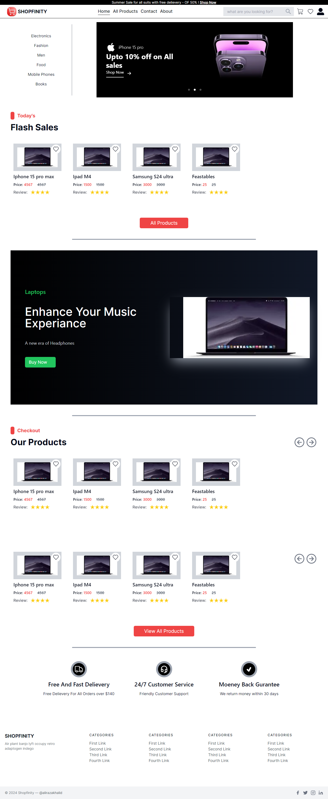

# Shopfinity

Welcome to **Shopfinity**, an advanced eCommerce application built with the latest technologies. Shopfinity offers a comprehensive solution for online shopping, including user authentication, product management, payment processing, and an intuitive admin dashboard.



## Features

- **Next.js 14**: Utilizes the latest app router and features from Next.js for fast, SEO-friendly, and server-side rendered web applications.
- **MongoDB**: A NoSQL database for efficient data storage and retrieval.
- **Auth.js (Next-Auth)**: Secure and scalable authentication solutions.
- **Stripe**: Integrated payment gateway for handling transactions.
- **Admin Dashboard**: Manage products, orders, and users seamlessly.
- **Responsive Design**: Ensures a great user experience on all devices.
- **Shipping Address Collection**: Collect and manage shipping details with ease.
- **Tailwind CSS**: For efficient and customizable styling.

## Getting Started

### Prerequisites

- Node.js (v14.x or later)
- npm (v6.x or later) or yarn (v1.x or later)
- MongoDB instance
- Stripe account and API keys

### Installation

1. **Clone the repository**

    ```bash
    git clone https://github.com/yourusername/shopfinity.git
    cd shopfinity
    ```

2. **Install dependencies**

    ```bash
    npm install
    # or
    yarn install
    ```

3. **Environment Variables**

    Create a `.env.local` file in the root directory and add the following environment variables:

    ```plaintext
    MONGODB_URI=your_mongodb_connection_string
    AUTH_SECRET=your_auth_secret
    AUTH_GITHUB_ID=your_github_client_id
    AUTH_GITHUB_SECRET=your_github_client_secret
    AUTH_GOOGLE_ID=your_google_client_id
    AUTH_GOOGLE_SECRET=your_google_client_secret
    NEXT_STRIPE_SECRET_KEY=your_stripe_secret_key
    NEXT_STRIPE_PUBLIC_KEY=your_stripe_public_key
    STRIPE_WEBHOOK_SECRET=your_stripe_webhook_secret
    RESEND_API_KEY=your_resend_api_key
    NEXT_ADMIN_EMAIL=your_admin_email
    AUTH_TRUST_HOST=true
    ```

4. **Run the development server**

    ```bash
    npm run dev
    # or
    yarn dev
    ```

    Open [http://localhost:3000](http://localhost:3000) with your browser to see the result.

## Project Structure

- **/app**: Contains all the routes.
- **/components**: Reusable React components.
- **/lib**: Configuration for MongoDB, Stripe, and authentication.
- **/lib/models**: Mongoose models for MongoDB.
- **/utils**: Utility functions.

## Usage

### Authentication

- Users can sign up and log in using their email or third-party providers (Google, GitHub, etc.).
- Authenticated users can access their profiles, order history, and more.

### Admin Dashboard

- Accessible only by users with admin privileges.
- Manage products: Add, edit, or delete products.
- Manage orders: View order details, update order status.
- Manage users: View user information, assign admin roles.

### Payments

- Integrated with Stripe for secure payment processing.
- Users can add items to the cart and proceed to checkout.
- Shipping address collection during checkout.

### Tailwind CSS

- Tailwind CSS is used for styling. You can customize the styles by editing the `tailwind.config.js` file and adding your custom CSS classes in the `styles/globals.css` file.


## Contributing

We welcome contributions! Please follow these steps to contribute:

1. Fork the repository.
2. Create a new branch (`git checkout -b feature/your-feature`).
3. Make your changes.
4. Commit your changes (`git commit -am 'Add new feature'`).
5. Push to the branch (`git push origin feature/your-feature`).
6. Create a new Pull Request.

## License

This project is licensed under the MIT License. See the [LICENSE](LICENSE) file for more details.

## Acknowledgements

- [Next.js](https://nextjs.org/)
- [MongoDB](https://www.mongodb.com/)
- [Auth.js (Next-Auth)](https://authjs.dev)
- [Stripe](https://stripe.com/)
- [Tailwind CSS](https://tailwindcss.com/)

---

## Live Demo

Check out the live demo of Shopfinity [here](https://shopfinity-ecommerce.netlify.app).

Feel free to customize this `README.md` file according to your project's specific requirements. Enjoy building with Shopfinity!